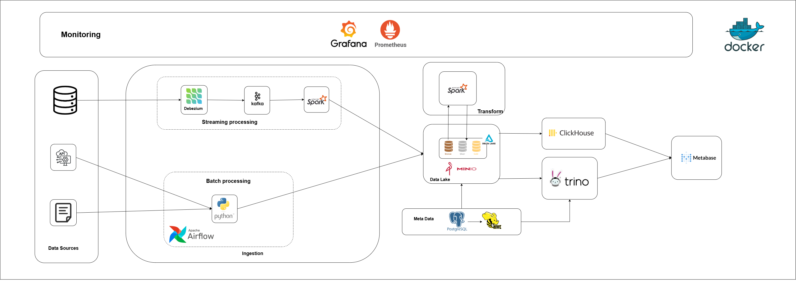
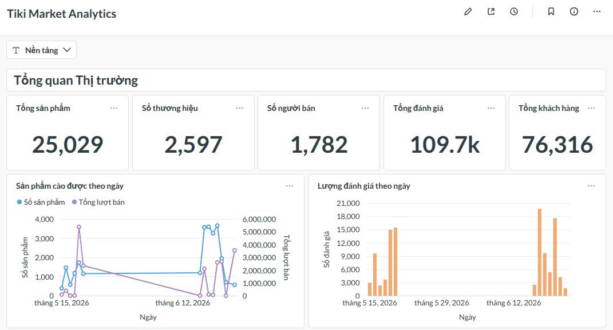
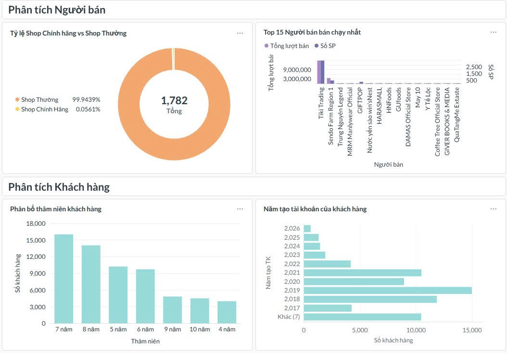
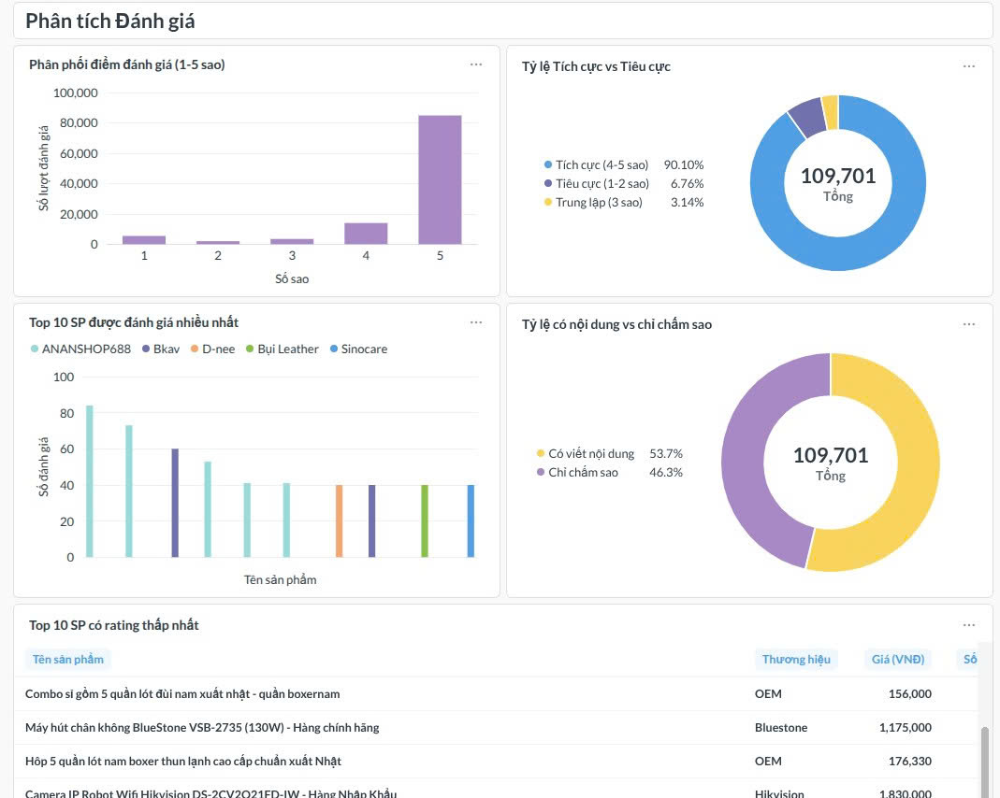
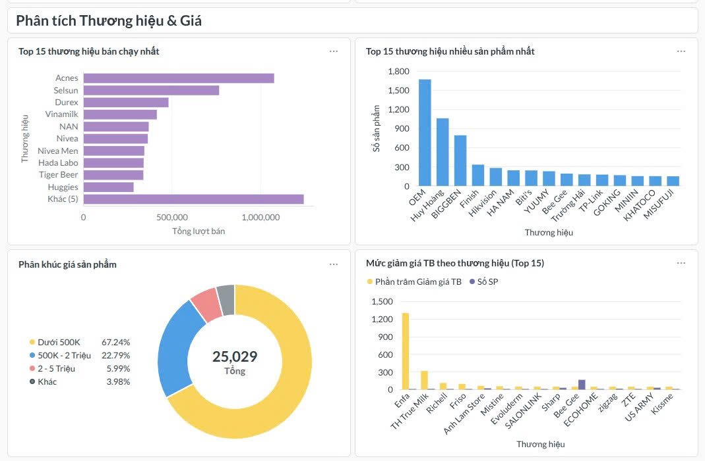

# Ecommerce Lakehouse

Ecommerce Lakehouse là hệ thống dữ liệu end-to-end dùng để thu thập thông tin sản phẩm, người bán và đánh giá từ các sàn thương mại điện tử, lưu trữ dữ liệu theo kiến trúc Medallion trên MinIO, xử lý dữ liệu bằng Spark hoặc Pandas/Delta Lake và trực quan hóa kết quả bằng Metabase.

Repository hiện hỗ trợ các nguồn Tiki, Shopee, Sendo và Chợ Tốt. Ngoài dữ liệu crawl thực tế, dự án còn có luồng mô phỏng giao dịch PostgreSQL và truyền thay đổi dữ liệu theo thời gian thực qua Debezium, Kafka.

## Kiến trúc hệ thống



Luồng dữ liệu chính:

```text
Website/API thương mại điện tử
        │
        ▼
Python crawler + Airflow
        │
        ▼
MinIO Bronze (JSON thô)
        │
        ▼
Spark hoặc Pandas + Delta Lake
        │
        ├────────► MinIO Silver (dữ liệu sạch, chuẩn hóa)
        │                         │
        │                         ▼
        └────────► MinIO Gold (dữ liệu phân tích)
                                  │
                         ┌────────┴────────┐
                         ▼                 ▼
                    ClickHouse           Trino
                         └────────┬────────┘
                                  ▼
                              Metabase
```

Hệ thống gồm các thành phần chính:

| Thành phần | Vai trò |
| --- | --- |
| Python, Selenium, Browserless | Thu thập sản phẩm, người bán và đánh giá từ website/API |
| Apache Airflow | Lập lịch và điều phối các tác vụ ingestion, processing |
| MinIO | Object storage chứa các layer Bronze, Silver và Gold |
| Apache Spark / Pandas | Làm sạch, chuẩn hóa, khử trùng lặp và tổng hợp dữ liệu |
| Delta Lake | Định dạng bảng hỗ trợ ACID, schema và cập nhật dữ liệu trên MinIO |
| Hive Metastore + PostgreSQL | Quản lý metadata của các bảng lakehouse |
| Trino | Truy vấn trực tiếp các bảng Delta trên MinIO |
| ClickHouse | Serving database tối ưu cho truy vấn phân tích |
| Metabase | Xây dựng dashboard và trực quan hóa dữ liệu |
| Debezium + Kafka | Luồng CDC cho dữ liệu giao dịch mô phỏng |
| Prometheus / Grafana | Nền tảng giám sát có thể mở rộng cho hệ thống |

### Các layer dữ liệu

- **Bronze**: lưu nguyên trạng dữ liệu JSON từ crawler hoặc sự kiện CDC. Dữ liệu batch được tổ chức theo Hive-style partition:

  ```text
  provider=<source>/date=<yyyy-mm-dd>/category=<category>/<file>.json
  ```

  Ví dụ:

  ```text
  provider=tiki/date=2026-05-15/category=products/batch_pg1_*.json
  provider=tiki/date=2026-05-15/category=reviews/reviews_sp_*.json
  ```

- **Silver**: dữ liệu đã được làm sạch, ép kiểu, chuẩn hóa và khử trùng lặp, lưu dưới dạng Delta Lake. Dữ liệu crawl thực tế nằm tại `s3a://silver-lakehouse/real_data`; dữ liệu CDC được tổ chức thành các bảng nghiệp vụ trong `s3a://silver-lakehouse`.
- **Gold**: các bảng dimension/fact và dữ liệu tổng hợp phục vụ BI, lưu tại `s3a://gold-lakehouse` rồi được truy vấn qua Trino hoặc đồng bộ sang ClickHouse.

## Cấu trúc repository

```text
.
├── ingestion/                 # Batch crawlers và provider clients
├── processing/
│   ├── jobs/                  # Entry point các job xử lý
│   ├── streaming/             # Spark/Pandas Bronze → Silver → Gold
│   └── core/                  # Spark session, Hive/MinIO utilities
├── airflow/                   # DAG và Docker Compose riêng của Airflow
├── analytics/metabase/        # Script khởi tạo/cấu hình dashboard Metabase
├── storage/                   # Công cụ kiểm tra và đọc dữ liệu MinIO
├── simulator/                 # Sinh dữ liệu giao dịch mô phỏng
├── trino/catalog/             # Catalog Delta/Hive cho Trino
├── monitoring/                # Cấu hình Prometheus
├── images/                    # Sơ đồ kiến trúc và ảnh dashboard
└── docker-compose.yml         # Hạ tầng lakehouse local
```

## Yêu cầu

- Git
- Docker Engine/Desktop có Docker Compose v2
- Python 3.10 trở lên nếu chạy crawler hoặc job Pandas trực tiếp trên host
- Khuyến nghị tối thiểu 8 GB RAM trống cho toàn bộ stack; có thể chỉ khởi động các service cần thiết nếu máy có ít tài nguyên

## Cài đặt nhanh

### 1. Clone repository

```bash
git clone <repository-url>
cd ecommerce-lakehouse
```

### 2. Tạo các tệp môi trường

Linux/macOS:

```bash
cp .env.example .env
cp processing/.env.example processing/.env
cp airflow/.env.example airflow/.env
```

Windows PowerShell:

```powershell
Copy-Item .env.example .env
Copy-Item processing/.env.example processing/.env
Copy-Item airflow/.env.example airflow/.env
```

Các giá trị mặc định trong file mẫu dùng cho môi trường local. Hãy thay toàn bộ password, cookie và thông tin kết nối remote trước khi triển khai ở môi trường khác. Không commit `.env` lên Git.

### 3. Khởi động hạ tầng

Kiểm tra cấu hình trước khi chạy:

```bash
docker compose config
```

Khởi động toàn bộ stack:

```bash
docker compose up -d --build
```

Hoặc chỉ khởi động luồng batch crawl và analytics:

```bash
docker compose up -d minio postgres hive-metastore browserless spark-processor trino clickhouse metabase
```

Kiểm tra trạng thái:

```bash
docker compose ps
```

### 4. Cài Python nếu chạy trên host

Linux/macOS:

```bash
python -m venv venv
source venv/bin/activate
pip install -r requirements.txt
```

Windows PowerShell:

```powershell
python -m venv venv
.\venv\Scripts\Activate.ps1
pip install -r requirements.txt
```

## Các địa chỉ dịch vụ

| Dịch vụ | Địa chỉ local | Ghi chú |
| --- | --- | --- |
| MinIO API | `http://localhost:9000` | S3-compatible endpoint |
| MinIO Console | [http://localhost:9001](http://localhost:9001) | `admin` / `password123` theo cấu hình dev |
| Browserless | `http://localhost:3000` | Remote Chrome/WebDriver |
| Spark UI | [http://localhost:4040](http://localhost:4040) | Chỉ xuất hiện khi Spark job đang chạy |
| Hive Metastore | `thrift://localhost:9083` | Metadata service |
| Trino | [http://localhost:8082](http://localhost:8082) | SQL query engine |
| ClickHouse HTTP | `http://localhost:8123` | Native TCP tại `localhost:9009` |
| Metabase | [http://localhost:3001](http://localhost:3001) | BI dashboard |
| Kafka | `localhost:9092` | Event streaming |
| Kafka UI | [http://localhost:8080](http://localhost:8080) | Quan sát topic và message |
| Debezium Connect | `http://localhost:8083` | Kafka Connect REST API |
| PostgreSQL source | `localhost:5433` | Dữ liệu giao dịch mô phỏng |
| PostgreSQL metastore | `localhost:5432` | Backend của Hive Metastore |

Các credential trên chỉ là mặc định local-dev hiện có trong `docker-compose.yml`.
Các cổng được bind vào `127.0.0.1` theo mặc định để không vô tình mở dịch vụ ra mạng LAN/Internet.

## Thu thập dữ liệu vào Bronze

Đảm bảo MinIO và Browserless đã chạy, đồng thời `.env` sử dụng endpoint của host (`http://localhost:9000`, `http://localhost:3000/webdriver`).

### Tiki

```bash
python ingestion/batch/main.py --category 1846 --limit_pages 1
```

Nếu bỏ `--category`, crawler đọc trạng thái trong `crawler_state.txt` và chạy tuần tự các danh mục. Dữ liệu sản phẩm và review được upload trực tiếp vào bucket `bronze-lakehouse`.

### Shopee

API Shopee có thể yêu cầu cookie từ một phiên trình duyệt hợp lệ. Đặt `SHOPEE_COOKIE` trong `.env`, không đưa cookie thật vào Git.

```bash
python ingestion/batch/main_shopee.py \
  --keyword "dien thoai" \
  --start_page 0 \
  --end_page 0 \
  --review_products_limit 3 \
  --review_pages 1 \
  --fetch_mode api
```

Crawler cũng hỗ trợ `browser_api`, `html`, `api_then_html` và `browser_api_then_html`. Chạy `python ingestion/batch/main_shopee.py --help` để xem toàn bộ tùy chọn.

### Sendo

```bash
python ingestion/batch/main_sendo.py --keyword "sua" --start_page 1 --end_page 1
```

### Chợ Tốt

```bash
python ingestion/batch/main_chotot.py --keyword "iphone" --start_page 1 --end_page 1
```

Hãy tôn trọng điều khoản sử dụng, robots policy và giới hạn tần suất của từng nguồn dữ liệu.

## Xử lý dữ liệu

### Batch JSON thực tế: Bronze → Silver

Job tổng quát hiện xử lý dữ liệu JSON từ Tiki, Sendo và Chợ Tốt:

```bash
docker exec -it spark_processor python /app/jobs/bronze_json_to_silver_real.py \
  --providers tiki \
  --hive-db silver_real
```

Có thể xử lý nhiều nguồn trong cùng một lần chạy:

```bash
docker exec -it spark_processor python /app/jobs/bronze_json_to_silver_real.py \
  --providers tiki,sendo,chotot \
  --hive-db silver_real
```

Kết quả mặc định được ghi dưới dạng Delta vào Silver và đăng ký metadata trong Hive Metastore. Shopee crawler đã ghi được dữ liệu Bronze, nhưng repository hiện chưa có parser Shopee trong job `bronze_json_to_silver_real.py`; cần bổ sung mapping chuẩn hóa trước khi đưa nguồn này vào Silver.

### Luồng CDC bằng Spark

```bash
# Kafka → Bronze
docker exec -it spark_processor python /app/streaming/kafka_to_bronze.py

# Bronze → Silver
docker exec -it spark_processor python /app/jobs/bronze_to_silver.py

# Silver → Gold
docker exec -it spark_processor python /app/jobs/silver_to_gold.py
```

### Luồng nhẹ bằng Pandas/Delta Lake

Các job này sử dụng `deltalake` Rust core và đồng bộ Hive Metastore trực tiếp, phù hợp với máy không muốn chạy Spark:

```bash
python processing/streaming/pandas_kafka_to_bronze.py --bootstrap-servers localhost:9092
python processing/streaming/pandas_bronze_to_silver.py --hive-db silver
python processing/streaming/pandas_silver_to_gold.py --hive-db gold
```

Khi chạy bên trong container `pandas_processor`, các hostname phải là tên service Docker như `minio`, `postgres`, `kafka` thay vì `localhost`.

## Phục vụ dữ liệu cho Metabase

Metabase không xử lý dữ liệu thô. Dashboard kết nối tới một trong hai lớp serving:

### Trino đọc trực tiếp Delta Lake

Trino sử dụng catalog trong `trino/catalog/` và metadata từ Hive Metastore để truy vấn bảng Delta trên MinIO. Sau khi mở Metabase tại `http://localhost:3001`, thêm database Trino với:

- Host: `trino`
- Port: `8080`
- Catalog: `delta`
- Schema: `gold` hoặc schema đã đăng ký
- Username: một giá trị bất kỳ cho môi trường local nếu Trino chưa bật authentication

### ClickHouse cho truy vấn analytics

Tạo bảng và đồng bộ Gold sang ClickHouse:

```bash
docker exec -it pandas_processor python /app/create_clickhouse_tables.py \
  --layer gold \
  --database gold_serving \
  --base-path s3a://gold-lakehouse

docker exec -it pandas_processor python /app/streaming/pandas_silver_to_clickhouse.py \
  --database gold_serving \
  --mode replace \
  --once
```

Với dữ liệu crawl thực tế ở Silver:

```bash
docker exec -it pandas_processor python /app/create_clickhouse_tables.py \
  --layer silver-real \
  --database silver_real_serving \
  --base-path s3a://silver-lakehouse/real_data

docker exec -it pandas_processor python /app/jobs/tiki_silver_real_to_clickhouse.py \
  --database silver_real_serving \
  --silver-base s3a://silver-lakehouse/real_data \
  --once
```

Trong Metabase, thêm ClickHouse với host `clickhouse`, port HTTP `8123`, database `gold_serving` hoặc `silver_real_serving`, và credential tương ứng trong compose.

Script hỗ trợ tạo dashboard nằm trong `analytics/metabase/`. Nên truyền `METABASE_URL`, `METABASE_USER`, `METABASE_PASSWORD` qua biến môi trường thay vì ghi credential vào source code.

## Dashboard minh họa

### Tổng quan thị trường



### Người bán và khách hàng



### Đánh giá sản phẩm



### Thương hiệu và giá



Các đường dẫn ảnh đều là đường dẫn tương đối nên sẽ hiển thị trực tiếp khi README được xem trên GitHub.

## Luồng CDC mô phỏng

Luồng mở rộng dùng `simulator/` để sinh giao dịch vào PostgreSQL, Debezium bắt thay đổi và đẩy sự kiện vào Kafka trước khi xử lý qua các layer:

```text
Simulator → PostgreSQL → Debezium → Kafka → Bronze → Silver → Gold
```

Chạy simulator trên host:

```bash
python simulator/simulate.py
```

Mặc định PostgreSQL source được publish tại `localhost:5433`. Cần đăng ký connector Debezium trước khi mong đợi sự kiện CDC xuất hiện trên Kafka.

## Airflow

Airflow có Docker Compose riêng trong thư mục `airflow/`:

```bash
cd airflow
docker compose up airflow-init
docker compose up -d
```

Trên Linux, đặt đúng `AIRFLOW_UID` trong `airflow/.env`. `HOST_WORKSPACE_PATH` phải là đường dẫn tuyệt đối tới repository trên máy host để DAG có thể mount và chạy mã nguồn của dự án.

Lưu ý: Airflow và Kafka UI mặc định đều có thể dùng cổng host `8080`; nếu chạy hai Compose project cùng lúc, hãy đổi một mapping port để tránh xung đột.

## Kiểm tra

```bash
# Kiểm tra cấu hình hạ tầng
docker compose config

# Kiểm tra kết nối MinIO
python storage/check_minio_connection.py

# Kiểm tra kết nối lakehouse
python processing/test_lakehouse.py

# Xem bảng ClickHouse
docker exec clickhouse_server clickhouse-client -q "SHOW TABLES IN gold_serving"

# Xem log service khi có lỗi
docker compose logs -f minio spark-processor hive-metastore trino metabase
```

Nếu một service không healthy hoặc job không kết nối được:

- Dùng `localhost` khi tiến trình chạy trên host; dùng tên service (`minio`, `postgres`, `kafka`, `clickhouse`) khi chạy trong Docker network.
- Kiểm tra bucket và credential MinIO trong `.env`/`processing/.env`.
- Kiểm tra Hive Metastore trước khi truy vấn bảng Delta bằng Trino.
- Spark UI chỉ lắng nghe ở cổng `4040` trong thời gian job Spark đang chạy.
- Shopee có thể trả HTTP 403 hoặc trang xác minh; cập nhật cookie hợp lệ và giảm tần suất request thay vì cố vượt captcha.

## Bảo mật và dữ liệu

- Không commit `.env`, cookie, access key hoặc mật khẩu production.
- Không commit dữ liệu crawl sinh ra trong `ingestion/batch/raw_data/`.
- Không xóa Docker volumes nếu chưa sao lưu; volumes chứa dữ liệu MinIO, PostgreSQL, Kafka, ClickHouse và Metabase.
- Các credential trong Docker Compose chỉ dành cho phát triển local và phải được thay đổi khi triển khai thật.

## License

Repository hiện chưa khai báo license. Hãy bổ sung tệp `LICENSE` trước khi phát hành hoặc cho phép tái sử dụng công khai.
